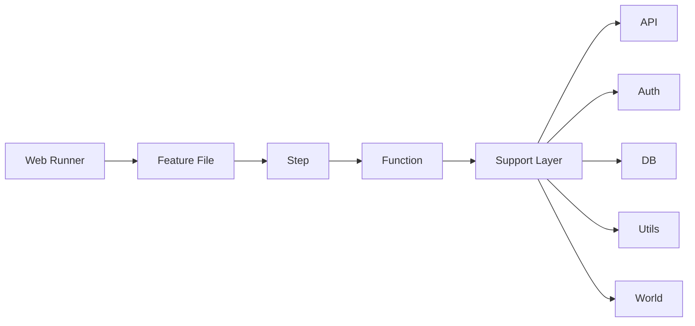

# Repository Structure

This project is organized into 3 main parts:

- features → define scenarios
- step_definitions → execute steps
- support → provide shared logic

---

## Core folders

```text
features/                → scenario files
src/step_definitions/    → step system
support/                 → api / auth / db / utils
```

---

## Features

```text
features/advisors/
  get_advisors.feature
  get_advisors+me.feature
  get_advisors+{advisorid}.feature
```

Organized by API/resource.

---

## Step system

```text
functions/ → logic
steps/     → mapping
```

Steps map text.
Functions execute logic.

---

## Support

```text
support/
  api/
  db/
  utils/
  world.js
```

Shared utilities used by step functions.

---

## Flow Diagram



### What actually happened

- Web Runner → starts execution
- Feature → defines scenario
- Step → matches text
- Function → runs logic
- Support → handles shared execution logic